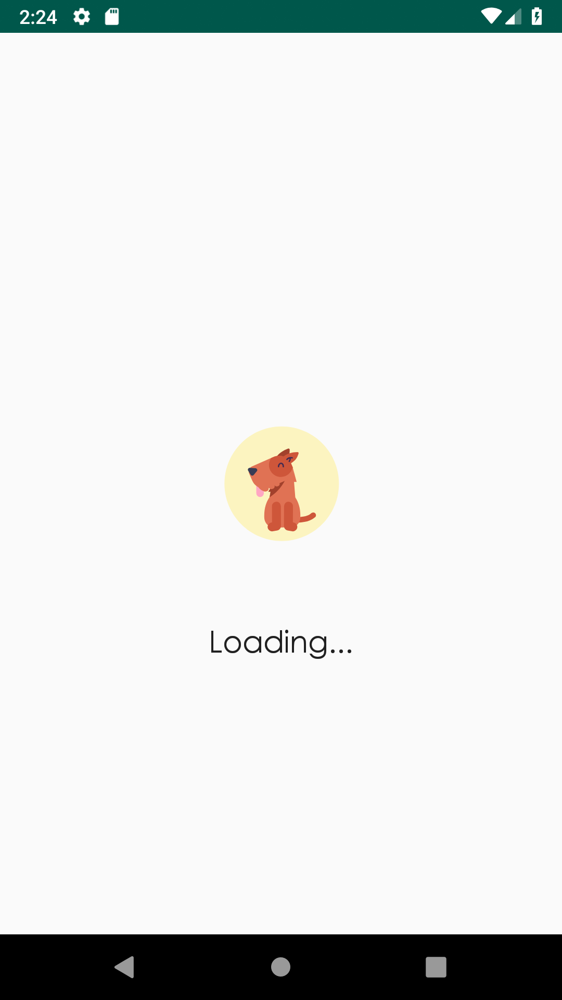
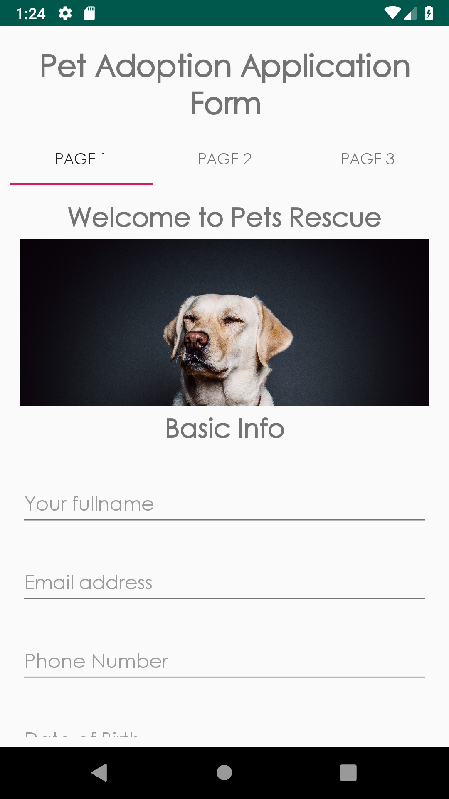
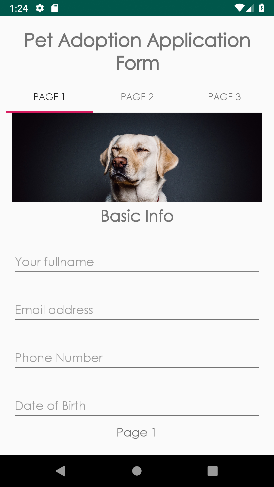
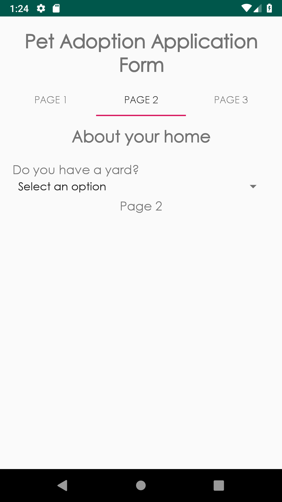
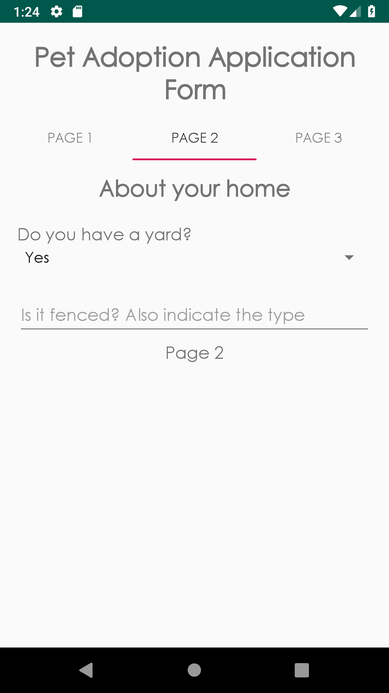
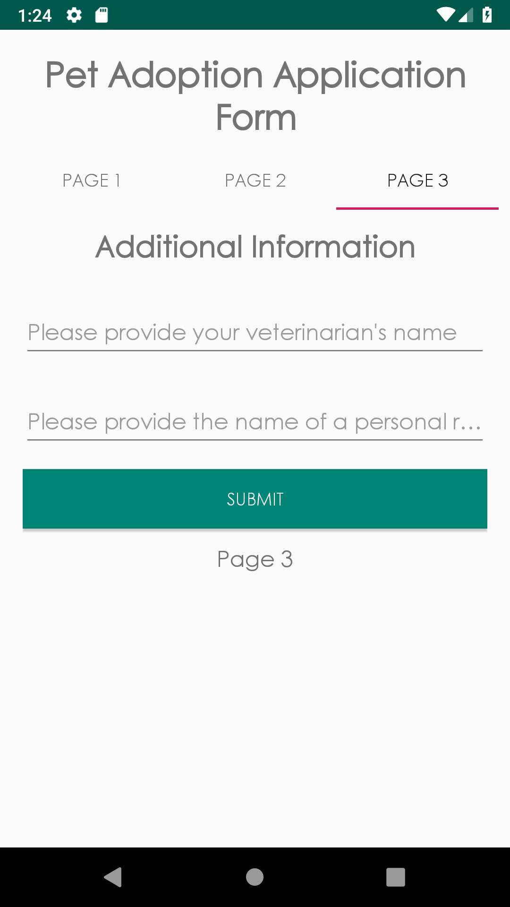

# DynamicFormForPetAdoption
This project is about creating views dynamically based on a json response. In this project the sample data involves creating a multipage form for adopting a pet.  

